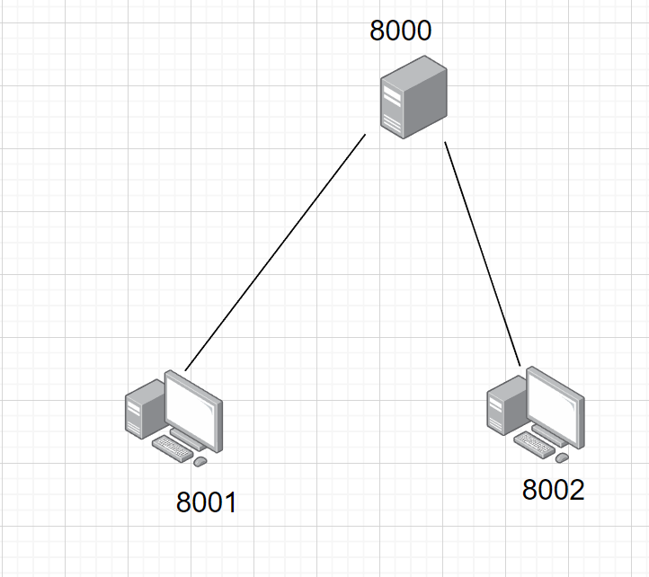
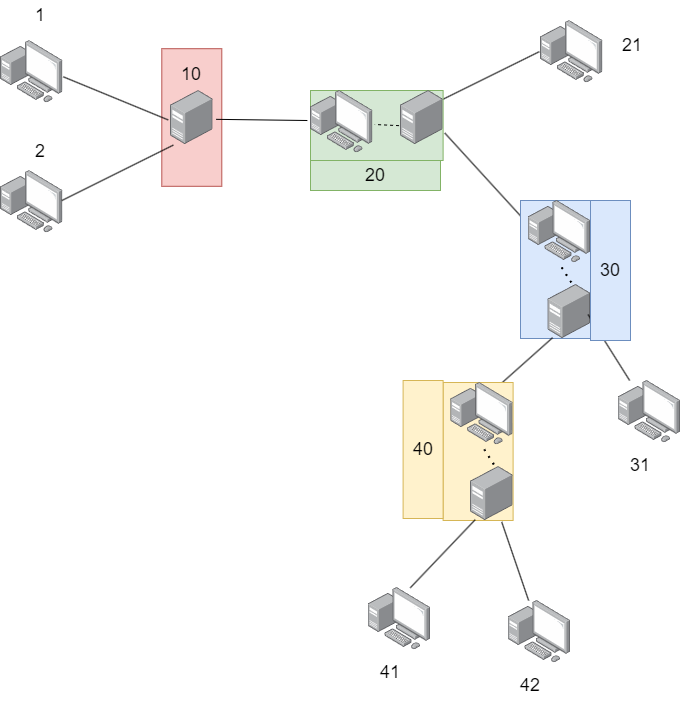

# Node是一个用Golang实现的TCP库

## 概述
node：对连接的功能进行了封装，连接视为节点，每个节点都有一个唯一的ID，功能主要包含有请求、节点间转发数据
#### Q:现在的网络已经实现你所说的功能，为什么还要封装协议大费周章？
#### A:当前网络双方通信都必须有公网IP，而两个内网中的计算机无法知道对方的公网IP，就算知道也会被nat、防火墙等阻挡无法通信，Node是基于节点ID通信的，所以知道ID、对方上线，不论他是否公网都可以通信。

## 协议报式
```go
type Message struct {
  Type   uint8
  Id     uint32
  SrcId  uint16
  DestId uint16
  Data   []byte
}
```
<table >
  <tr>
    <th rowspan="2" >Header 13Byte</th>
    <td >Typ 1Byte</td>
    <td >Id 3Byte</td>
    <td >SrcId 2Byte</td>
    <td >DestId 2Byte</td>
    <td >DataLength 3Byte</td>
  </tr>
  <tr >
    <td align="center" colspan="5">CheckSum 2Byte</td>
  </tr>
  <tr >
    <td align="center" colspan="6">Data</td>
  </tr>
</table>

单次数据最大发送长度为3个字节的正整数容量15MB

## 使用
```
go get -u github.com/Li-giegie/node@latest
```
#### Node.Handler接口负责连接的生命周期，下文对Node.Handler接口进行了介绍，默认接口生命周期是同步调用。
1. Connection 同步调用：该方法在连接建立时被调用
2. Handle 默认同步调用：异同步取决于你，如果该回调阻塞将影响当前连接整个生命周期（对于一些不消耗时间的任务，重新开启一个goroutine执行未必最优），框架并没有集成协程池，第三方框架众多，一时拿不定主意，索性把问题抛给你
3. ErrHandle 默认同步调用：异同步取决于你，当发送消息失败时会被触发
4. CustomHandle 默认同步调用：异同步取决于你，自定义消息类型处理，框架内部集成了多种消息类型，当需要一些特定的功能时可以自定义消息类型，例如心跳消息，只需把消息类型声明成框架内部不存在的类型，框架看到不认识的消息就会回调当前函数
5. Disconnect 同步调用：连接断开会被触发
```go
type Handler interface {
    // Connection 同步调用，连接第一次建立成功回调
    Connection(conn common.Conn)
    // Handle 接收到标准类型消息时触发回调
    Handle(ctx common.Context)
    // ErrHandle 发送失败触发的回调
    ErrHandle(msg *common.Message, err error)
    // CustomHandle 接收到自定义类型消息时触发回调
    CustomHandle(ctx common.Context)
    // Disconnect 连接断开触发回调
    Disconnect(id uint16, err error)
}
```

## 功能
一个域内节点通信示例图如下



多域间节点互相通信如下



[example示例](example)

## 协议
[关于协议的进一步使用 README](protocol/README.md)
## 更新迭代
* 增加功能
