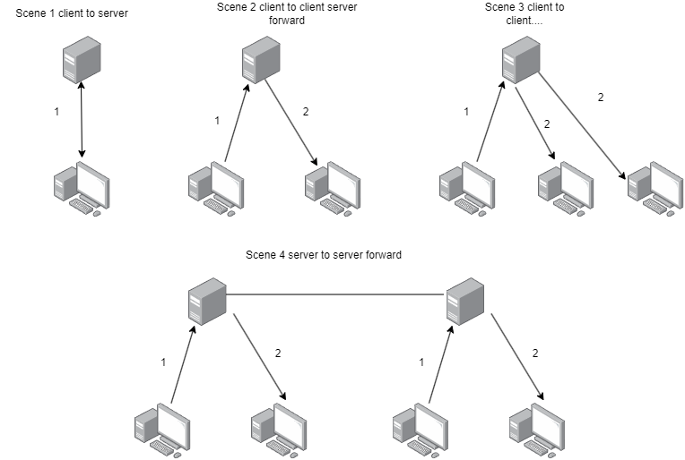

# Node是一个用Golang实现的高性能tcp框架
框架实现了客户端、服务端的封装，提供连接认证、请求、转发、功能，开箱即用，利用此框架可以轻易的实现一个转发服务器，把公网的请求转发到内网进行处理。

## 框架的核心思
* 简单：放弃各种设计模式、直观代码风格
* 靠谱：通过配置尽最大可能让其变得健壮，最终追求
* 高性能：采用多种措施，例如编解码不使用反射机制（go_jeans支持golang基础类型的编解码）
* 让内网节点参与进来

## 组成
由客户端节点、服务端节点组成、注册节点（待实现），节点之间互相通信
## 功能
* 认证：想要与服务节点建立连接首先应该进行认证，与服务端节点建立连接后会立即进入认证环节，认证保证客户端是否为非法。
    1. 服务端节点查看连接最大数量是否达到，达到返回认证失败关闭连接 | 否则服务端向客户端发送一个session id，等待一段时间，没有接收到消息关闭连接。
    2. 客户端节点向服务端节点发送自己的ID、session id、认证服务端的ID、认证数据，并等待服务端节点确认结果。
    3. 服务端节点判断session id和认证服务端的id与自己是否相同，如果相同，调用认证回调函数最终由决定是否通过认证
* 心跳机制：保持连接不会被网络通信设备认为当前连接不活跃被关闭采取的措施，通常是在一定周期内没有收到数据会被激活
* 发送数据
    1. send方法：仅为发送数据，并不需要具有回复，不需要明确目的地，如果api在节点中不存在，并不会通知客户端失败信息，所以客户端并不知晓这一次发送是否真的被处理，如果出现错误只会在tcp连接层出现问题才会产生，不需要明确目的地
    2. request方法：发送数据并希望在等待时间内得到对端的回复，不需要明确目的地
    3. forward方法：发送消息到指定节点处理，需要明确目的ID
## 场景
场景4目前并未支持，因为没有找到合适的方案

[example\示例](./example/)
