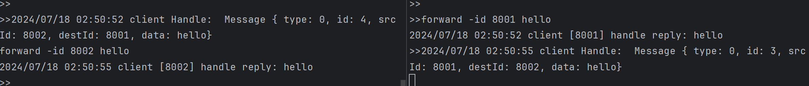

## basic示例展示了client、server节点之间简单通信

效果图


### 构建
客户端
```go
cd example/basic/client
go build
```
服务端
```go
cd example/basic/server
go build
```

### 启动
#### 服务端
启动：./server -lid 8000 -laddr "0.0.0.0:8000"

功能命令：request、send、forward

forward、request：在服务端示例中功能相同，都会得到回复
```
request -id 8001 hello //发送给8001节点 hello
```
send：仅发送，不等待回复
```
send -id 8001 hello //发送给8001节点 hello
```
#### 客户端
启动：./client -lid 8001 -raddr "0.0.0.0:8000"

功能命令：request、send、forward

request：请求到服务端节点，并等待回复 -time可以设置超时、这里默认3秒
```
request hello //发送给8001节点 hello
```
forward：转发到一个指定的节点上,等待回复
```
forward -id 8002 hello //发送给8001节点 hello
```

8002 节点启动：./client -lid 8002 -raddr "0.0.0.0:8000"

8001、8002互通
